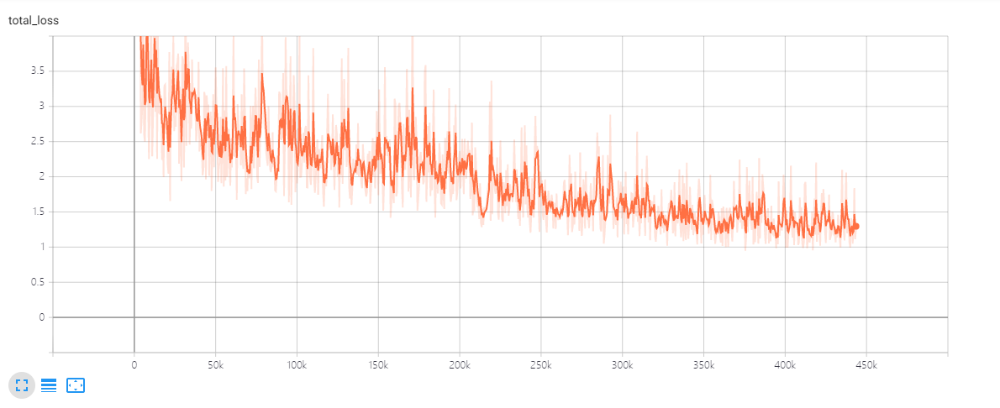
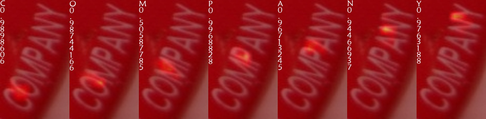
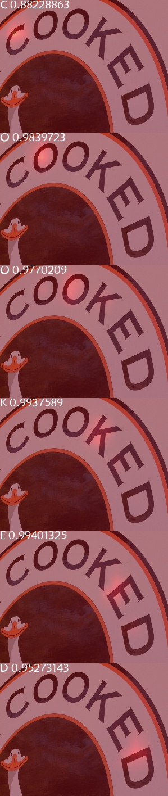
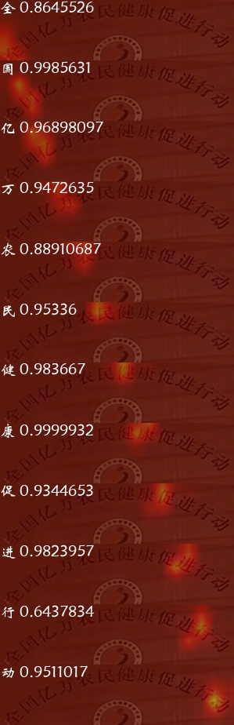
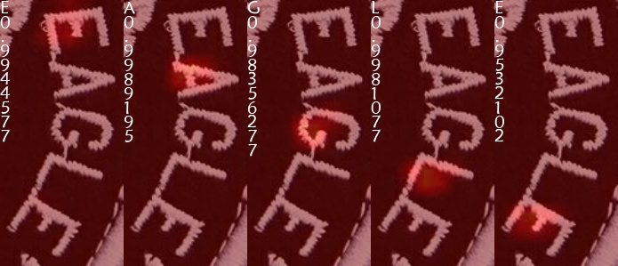
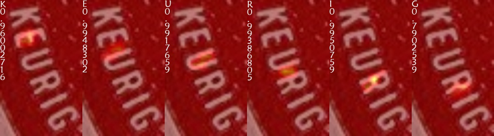

# AttentionOCR for Arbitrary-Shaped Scene Text Recognition

## Introduction

This is the **ranked No.1** tensorflow based scene text spotting algorithm on [__ICDAR2019 Robust Reading Challenge on Arbitrary-Shaped Text__](https://rrc.cvc.uab.es/?ch=14) (Latin Only, Latin and Chinese), futhermore, the algorithm is also adopted in [__ICDAR2019 Robust Reading Challenge on Large-scale Street View Text with Partial Labeling__](https://rrc.cvc.uab.es/?ch=16) and [__ICDAR2019 Robust Reading Challenge on Reading Chinese Text on Signboard__](https://rrc.cvc.uab.es/?ch=12). 

Scene text detection algorithm is modified from [__Tensorpack FasterRCNN__](https://github.com/tensorpack/tensorpack/tree/master/examples/FasterRCNN), and we only open source code in this repository for scene text recognition. I upload ICDAR2019 ArT competition model to docker hub, please refer to [Docker](#Docker).

Note that our text recognition algorithm not only recognize Latin and Non-Latin characters, but also support horizontal and vertical text recognition in one model. It is convenient for multi-lingual arbitrary-shaped text recognition.

## Dependencies

```
python 3
tensorflow-gpu 1.14
tensorpack 0.9.8
pycocotools
```

## Usage

<!-- It is recommended to get familiar the relevant papers listed below:
+ [Neural Machine Translation by Jointly Learning to Align and Translate](https://arxiv.org/abs/1409.0473)
+ [Show, Attend and Tell: Neural Image Caption Generation with Visual Attention](https://arxiv.org/abs/1502.03044) -->

First download and extract multiple text datasets in base text dir, please refer to dataset.py for dataset preprocess and multiple datasets.

### Multiple Datasets

```
$(base_dir)/lsvt
$(base_dir)/art
$(base_dir)/rects
$(base_dir)/icdar2017rctw
```

### Train

First, download pretrained [__inception v4 checkpoint__](https://github.com/tensorflow/models/tree/master/research/slim) and put it in ./pretrain folder. 
Then you can modify your gpu lists in config.py for specified gpus and then run:
```
python train.py
```
You can visualize your training steps via tensorboard:
```
tensorboard --logdir='./checkpoint'
```


Use ICDAR2019-LSVT, ICDAR2019-ArT, ICDAR2019-ReCTS for default training, you can change it with your own training data.

### Evaluation

```
python eval.py --checkpoint_path=$(Your model path)
```

Use ICDAR2017RCTW for default evaluation with Normalized Edit Distance metric(1-N.E.D specifically), you can change it with your own evaluation data. 

### Export

Export checkpoint to tensorflow pb model for inference.

```
python export.py --pb_path=$(Your tensorflow pb model save path) --checkpoint_path=$(Your trained model path)
```

### Test

Load tensorflow pb model for text recognition.
```
python test.py --pb_path=$(Your tensorflow pb model save path) --img_folder=$(Your test img folder)
```
Default use ICDAR2019-ArT for test, you can change it with your own test data. 

## Visualization

Scene text detection and recognition result:


Scene text recognition attention maps:



<!--  -->
<!--  -->
<!--  -->
<!--  -->
<!--  -->
<!--  -->

To learn more about attention mechanism, please refer to [Attention Mechanism in Deep Learning](reference/Attention_Mechanism_in_Deep_Learning.pdf). 

## Docker

I upload ICDAR2019 scene text recognition model include text detection and recognition to [__Docker Hub__](https://hub.docker.com/repository/docker/zhang0jhon/demo).

After [__nvidia-docker__](https://github.com/NVIDIA/nvidia-docker) installed, run:

```
docker pull zhang0jhon/demo:ocr
docker run --runtime=nvidia -p 5000:5000 -it zhang0jhon/demo:ocr bash
cd /ocr/ocr
python flaskapp.py
```

Then you can test with your data via browser:

```
$(localhost or remote server ip address):5000
```


**Note that the competition model in docker container is slightly different from the recognition model trained from this updated repository.**